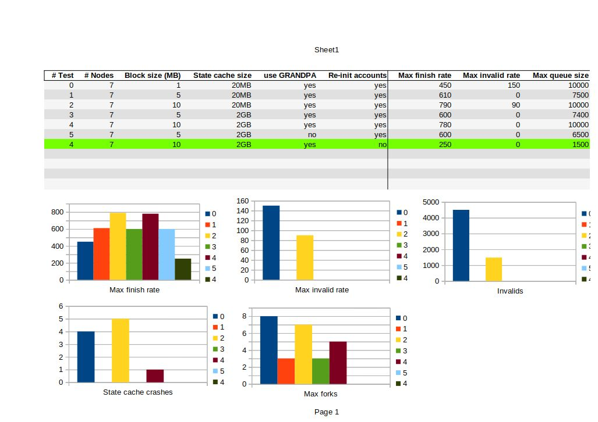
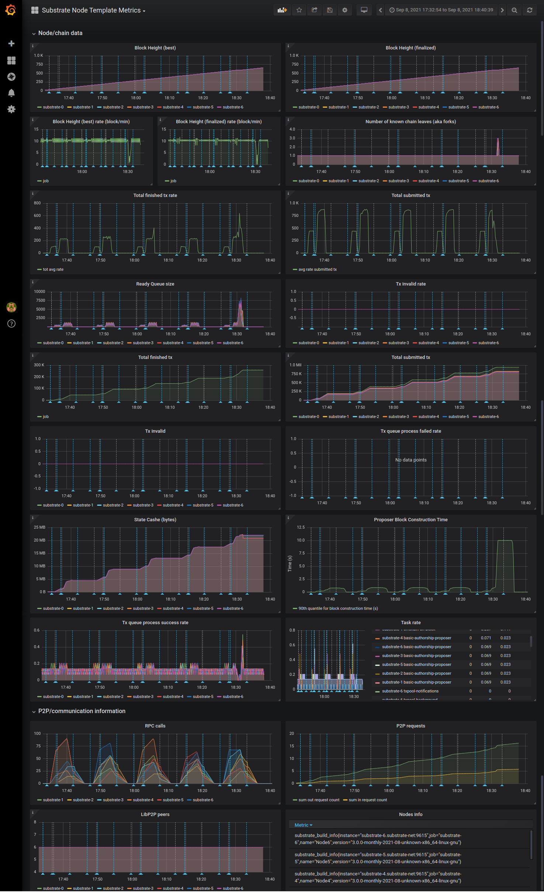
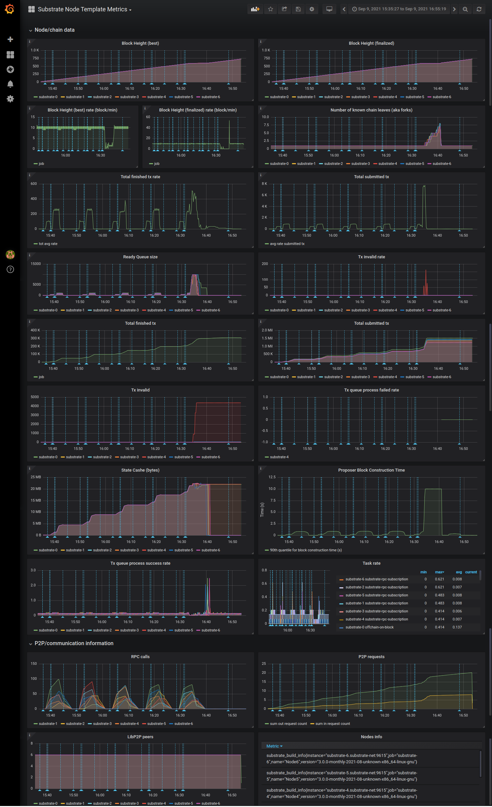
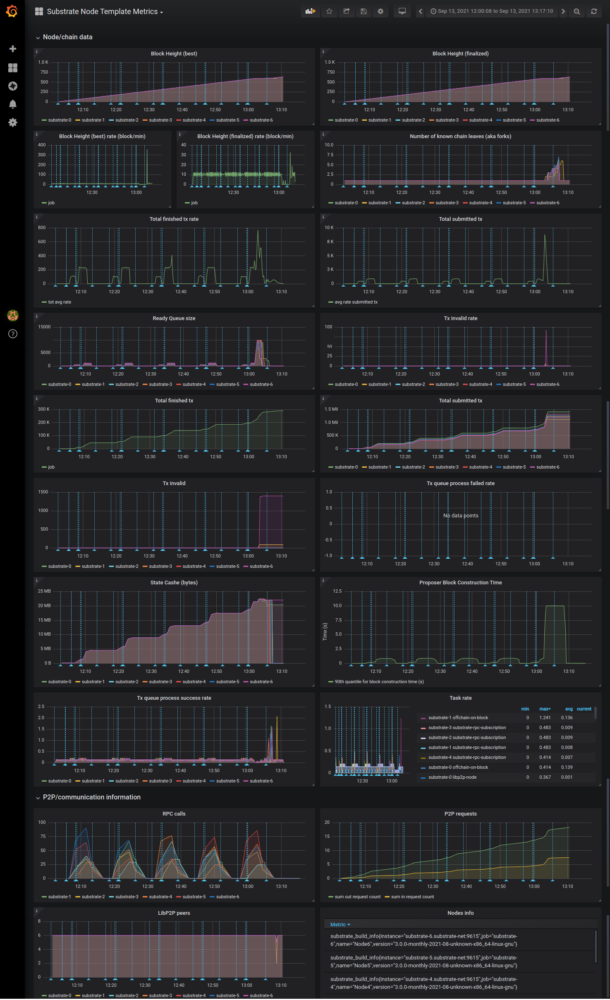
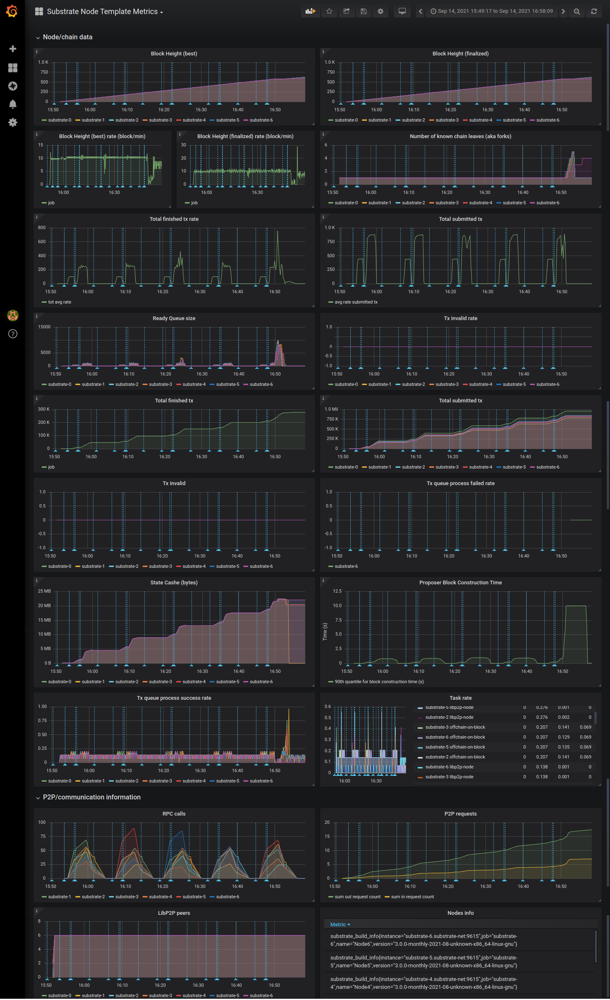
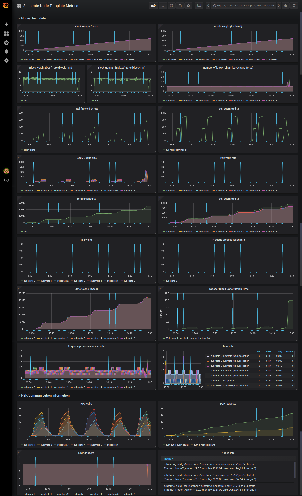
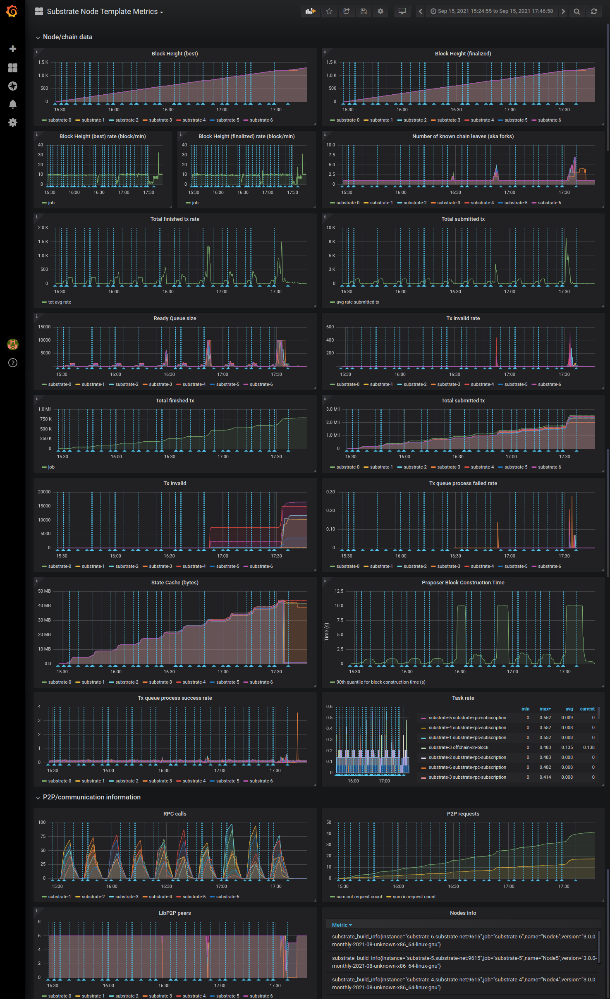

# Substrate first results

## About the first tests

- If 5 times same test -> tests finish rate worst at last test
  - High variance, no consistency ? 
- Default [block size = 5MB](../../substrate-node/substrate-node-template/runtime/src/lib.rs#L138)

## Global overview

## Change the blocksize

### 5MB no special changes

### 1MB no special changes

### 10MB no special changes

### Conclusion

> The block size **don't change** the performance significantly.

## Change the state cache size

### 10MB no special changes

### 5MB no special changes

## 10 tests

